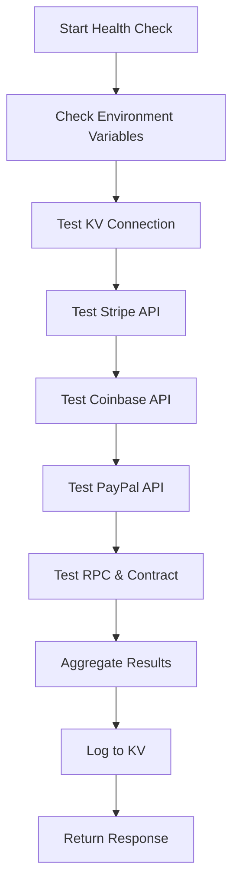

# ChaosKey333 Operations Readiness

This document outlines the operational readiness infrastructure for ChaosKey333, including self-test utilities, webhook handlers, and monitoring capabilities.

## Overview

The operational readiness system provides:

- **Passive Status Scanning**: Comprehensive health checks without mutations
- **Active Simulated Events**: Test-mode payload generation and validation
- **Relic Evolution Processing**: Post-decode mutation recording and broadcasting
- **Admin Console**: Web-based interface for monitoring and testing
- **KV Logging**: Persistent health report storage and history

## API Endpoints

### 1. Passive Status Scan

**Endpoint**: `GET /api/webhook-selftest`
**Authentication**: Requires `X-Admin-Token` header

Performs comprehensive health checks on all critical systems:

- Environment variable validation
- External service connectivity (Stripe, Coinbase, PayPal)
- Blockchain RPC and contract reachability
- KV storage accessibility

```bash
curl -s https://YOUR-APP.vercel.app/api/webhook-selftest \
  -H "X-Admin-Token: $TEMP_ADMIN_TOKEN"
```

**Response Codes**:
- `200`: All systems healthy
- `207`: Some systems degraded but functional
- `503`: Critical systems down
- `401`: Invalid or missing admin token

### 2. Active Simulated Event Trigger

**Endpoint**: `POST /api/webhook-selftest/trigger`
**Authentication**: Requires `X-Admin-Token` header
**Rate Limit**: 1 request per 60 seconds

Generates and validates test payloads for:

- Stripe payment webhooks
- Coinbase Commerce notifications
- PayPal order confirmations
- Blockchain mint/evolution hooks

```bash
curl -s https://YOUR-APP.vercel.app/api/webhook-selftest/trigger \
  -X POST \
  -H "X-Admin-Token: $TEMP_ADMIN_TOKEN" \
  -H "Content-Type: application/json"
```

**Features**:
- Test-mode only (no real transactions)
- Payload structure validation
- Integration testing
- Results logged to KV storage

### 3. Relic Evolution Hook

**Endpoint**: `POST /api/relic/evolve`
**Authentication**: None (webhook endpoint)

Processes blockchain events for relic minting and evolution:

- Records new relic creation
- Tracks evolution mutations
- Broadcasts real-time updates
- Logs processing results

**Supported Events**:
- `relic.mint_requested`: New relic creation
- `relic.evolution_triggered`: Relic transformation

## Admin Console

**URL**: `/admin/ops`

Web-based console providing:

- Real-time health monitoring
- One-click test execution
- Historical report viewing
- System status dashboard

**Features**:
- Admin token authentication
- Recent report history
- Visual status indicators
- Detailed error information

## Environment Variables

### Required Variables

```bash
# Security
TEMP_ADMIN_TOKEN=your-admin-token-here

# KV Storage
KV_REST_API_URL=https://your-kv-instance.upstash.io
KV_REST_API_TOKEN=your-kv-token-here

# Payment Providers
STRIPE_SECRET_KEY=sk_test_...
COINBASE_COMMERCE_API_KEY=your-coinbase-key
PAYPAL_CLIENT_ID=your-paypal-client-id
PAYPAL_CLIENT_SECRET=your-paypal-secret

# Blockchain
RPC_URL=https://your-rpc-endpoint.com
NEXT_PUBLIC_CONTRACT_ADDRESS=0x123...
NEXT_PUBLIC_CHAIN_ID=1
```

### Optional Variables

```bash
# Environment identification
NODE_ENV=production
```

## KV Storage Schema

### Health Reports

**Key Pattern**: `system:selftest:YYYY-MM-DD-HHMM`
**TTL**: 7 days

```json
{
  "timestamp": "2024-01-15T10:30:00.000Z",
  "overall_status": "healthy",
  "checks": [
    {
      "timestamp": "2024-01-15T10:30:00.000Z",
      "status": "pass",
      "component": "stripe",
      "details": {
        "message": "Stripe API connection successful",
        "latency_ms": 150
      },
      "duration": 150
    }
  ],
  "metadata": {
    "version": "1.0.0",
    "environment": "production",
    "uptime": 86400
  }
}
```

### Latest Report

**Key**: `system:selftest:latest`
**TTL**: 24 hours

Stores the most recent health check for quick access.

## Security Considerations

### Authentication

- All admin endpoints require `X-Admin-Token` header
- Token validation against `TEMP_ADMIN_TOKEN` environment variable
- 401 response for invalid or missing tokens

### Rate Limiting

- Trigger endpoint: 1 request per 60 seconds per client
- 429 response with retry-after when exceeded

### Test Mode Safety

- All simulated events run in test mode only
- No real charges, mints, or mutations
- Clear test indicators in all payloads

## Monitoring and Alerting

### Status Levels

- **Healthy**: All systems operational
- **Degraded**: Some non-critical issues
- **Down**: Critical system failures

### Component Checks

1. **Environment**: Configuration validation
2. **KV**: Storage connectivity and performance
3. **Stripe**: Payment processing API
4. **Coinbase**: Cryptocurrency payment API
5. **PayPal**: Alternative payment API
6. **RPC/Contract**: Blockchain connectivity

### Health Check Flow



## Deployment Checklist

### Pre-deployment

- [ ] Configure all environment variables on Vercel
- [ ] Verify KV storage accessibility
- [ ] Test external API credentials
- [ ] Validate RPC endpoint connectivity

### Post-deployment

- [ ] Run passive health check
- [ ] Execute trigger simulation
- [ ] Verify admin console access
- [ ] Check KV logging functionality

### Verification Commands

```bash
# 1. Passive health check
curl -s https://YOUR-APP.vercel.app/api/webhook-selftest \
  -H "X-Admin-Token: $TEMP_ADMIN_TOKEN" | jq .

# 2. Active trigger test
curl -s https://YOUR-APP.vercel.app/api/webhook-selftest/trigger \
  -X POST \
  -H "X-Admin-Token: $TEMP_ADMIN_TOKEN" \
  -H "Content-Type: application/json" | jq .

# 3. Test relic evolution endpoint
curl -s https://YOUR-APP.vercel.app/api/relic/evolve \
  -X POST \
  -H "Content-Type: application/json" \
  -d '{
    "id": "test-evolution-123",
    "event_type": "relic.mint_requested",
    "timestamp": "2024-01-15T10:30:00.000Z",
    "test_mode": true,
    "data": {
      "transaction": {
        "hash": "0xtest123",
        "from": "0xuser123",
        "to": "0xcontract123",
        "value": "0",
        "gas_used": 150000,
        "block_number": 18000000,
        "status": "success"
      },
      "relic": {
        "token_id": 1,
        "rarity": "common",
        "attributes": {"power": 25}
      },
      "payment": {
        "source": "test",
        "amount": "10.00",
        "currency": "USD",
        "payment_id": "test-payment-123"
      }
    }
  }' | jq .
```

## Troubleshooting

### Common Issues

1. **401 Unauthorized**
   - Verify `TEMP_ADMIN_TOKEN` is set correctly
   - Check `X-Admin-Token` header format

2. **503 Service Unavailable**
   - Check external API credentials
   - Verify RPC endpoint accessibility
   - Confirm KV storage configuration

3. **429 Rate Limited**
   - Wait 60 seconds between trigger requests
   - Check rate limiting logs

### Debug Information

Each health check includes:
- Component-specific error messages
- Response latency measurements
- Detailed failure information
- Timestamp and duration data

### Log Locations

- Application logs: Vercel function logs
- Health reports: KV storage (`system:selftest:*`)
- Admin console: Browser developer tools

## Future Enhancements

### Planned Features

- [ ] Scheduled CRON health checks
- [ ] Slack/Email alert notifications
- [ ] Grafana dashboard integration
- [ ] Advanced rate limiting
- [ ] Historical trending analysis

### Integration Opportunities

- [ ] GitHub Actions workflow triggers
- [ ] Discord webhook notifications
- [ ] PagerDuty incident management
- [ ] DataDog APM integration
- [ ] Custom metrics collection

## Support

For operational issues or questions:

1. Check the admin console at `/admin/ops`
2. Review recent health reports in KV storage
3. Examine Vercel function logs
4. Validate environment configuration
5. Test individual components manually

## Version History

- **v1.0.0**: Initial operational readiness implementation
  - Passive health checks
  - Active trigger simulation
  - Relic evolution processing
  - Admin console interface
  - KV storage integration