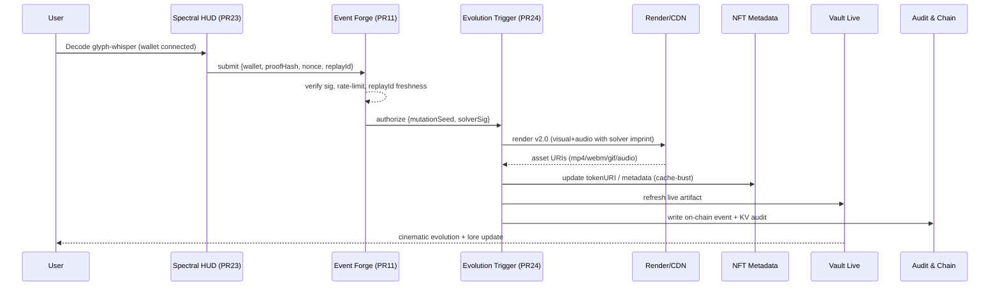

# Replay-to-Evolution Event Flow Documentation

This document maps the complete Replay → Decode → Evolution chain for the Sentinel Event Forge system, providing a comprehensive overview of the event flow, data contracts, APIs, and safety mechanisms.

## 1. Flowchart Overview

The following diagram visualizes the complete Replay → Decode → Evolution chain:

```mermaid
flowchart TD
  A[Replay Event Selected\nCosmic Replay Terminal] --> B{Spectral Decode HUD\n(PR #23) Active?}
  B -- Yes --> C[Glyph↔Whisper Alignment\nSolver Interaction]
  C --> D[Decode Complete\nProof Hash + Wallet Sig]
  D --> E[Event Forge (PR #11)\nValidate + Rate-limit + Sign]
  E --> F{Mutation Eligibility?}
  F -- Pass --> G[Relic Evolution Trigger (PR #24)]
  G --> H[Render Pipeline Update\nVideo/GIF/WebM + Audio Stem]
  H --> I[NFT Metadata v2.0\n(URI swap + cache bust)]
  I --> J[Vault Live Artifact Updated]
  J --> K[Broadcast Pulse\n(X/IG/TikTok + Webhooks)]
  E -- Fail --> E1[Reject + HUD Hint + Cooldown]

  subgraph Ledger & Audit
    L[On-chain Log\nsolver, proofHash, blockTime]
    M[KV/Firestore Audit\nmutationId, assets, rollforward]
  end

  G --> L
  G --> M
```

## 2. Sequence Diagram

Detailed sequence for key handshakes and interactions:



## 3. Supporting Details

### 3.1 States & Gates

#### System States
- **IDLE**: Waiting for replay selection
- **DECODING**: Spectral HUD active, glyph-whisper alignment in progress
- **VALIDATING**: Event Forge processing proof and signatures
- **EVOLVING**: Relic evolution and media rendering in progress
- **COMPLETE**: Evolution complete, vault updated
- **FAILED**: Process failed, cooldown active

#### Gate Conditions
- **Spectral HUD Gate**: User wallet connected + HUD active
- **Validation Gate**: Valid proof hash + signature + rate limit check
- **Mutation Gate**: Eligibility criteria met (solver reputation, relic type, cooldown)
- **Render Gate**: Media pipeline available + resource allocation

### 3.2 Data Contracts (JSON)

#### Replay Event Input
```json
{
  "replayId": "string",
  "walletAddress": "string", 
  "proofHash": "string",
  "nonce": "number",
  "timestamp": "number",
  "signature": "string"
}
```

#### Evolution Trigger Payload
```json
{
  "mutationSeed": "string",
  "solverSig": "string",
  "replayId": "string",
  "mutationId": "string",
  "relicTokenId": "number",
  "evolutionLevel": "number"
}
```

#### Media Asset Response
```json
{
  "videoUri": "string",
  "audioUri": "string", 
  "gifUri": "string",
  "webmUri": "string",
  "thumbnailUri": "string",
  "metadata": {
    "duration": "number",
    "resolution": "string",
    "fileSize": "number"
  }
}
```

#### NFT Metadata v2.0
```json
{
  "name": "string",
  "description": "string",
  "image": "string",
  "animation_url": "string",
  "attributes": [
    {
      "trait_type": "string",
      "value": "string"
    }
  ],
  "properties": {
    "evolution_level": "number",
    "solver_imprint": "string",
    "mutation_timestamp": "number",
    "replay_origin": "string"
  }
}
```

### 3.3 API Endpoints

#### Core APIs
- `POST /api/spectral-hud/decode` - Submit glyph-whisper proof
- `POST /api/event-forge/validate` - Validate and rate-limit mutations
- `POST /api/evolution/trigger` - Trigger relic evolution
- `GET /api/vault/artifact/{tokenId}` - Get live artifact data
- `POST /api/media/render` - Render evolution media
- `PUT /api/nft/metadata/{tokenId}` - Update NFT metadata

### 3.4 Telemetry Events

#### Event Types
- `replay.selected` - User selects replay event
- `hud.decode.start` - Decode process initiated
- `hud.decode.complete` - Decode successful
- `forge.validation.pass` - Validation successful
- `forge.validation.fail` - Validation failed
- `evolution.trigger` - Evolution process started
- `evolution.complete` - Evolution successful
- `media.render.start` - Media rendering started
- `media.render.complete` - Media rendering complete
- `vault.updated` - Vault artifact updated
- `broadcast.sent` - Social media broadcast sent

### 3.5 Failure Modes & Safety Rails

#### Rate Limiting
- Per-wallet: 1 evolution per 15 minutes
- Per-relic: 1 evolution per hour
- Global: Max 100 concurrent evolutions

#### Validation Failures
- Invalid proof hash → Reject with hint
- Signature mismatch → Security alert + temporary ban
- Replay ID reuse → Prevent with nonce tracking
- Insufficient gas → Queue for retry

#### Rollback Mechanisms
- Failed render → Revert metadata changes
- Blockchain failure → Retry with exponential backoff
- CDN upload failure → Use fallback storage

### 3.6 Permissions & Access Control

#### Role-Based Access
- **Solver**: Can submit proofs, trigger evolutions
- **Curator**: Can moderate content, pause system
- **Admin**: Full system access, emergency controls

#### Security Measures
- Wallet signature verification
- Proof-of-work validation
- Anti-replay protection
- Rate limiting per identity

### 3.7 Versioning

#### API Versioning
- Current: v2.0
- Backward compatibility: v1.x supported until Q2 2025
- Breaking changes: Minimum 30-day notice

#### Metadata Versioning
- Schema: v2.0 (with evolution tracking)
- Migration: Automatic from v1.x
- Rollback: Supported for 90 days

## 4. TypeScript Interfaces

### 4.1 Core Event Interfaces

```typescript
// Replay Event Types
interface ReplayEvent {
  replayId: string;
  walletAddress: string;
  proofHash: string;
  nonce: number;
  timestamp: number;
  signature: string;
}

interface SpectralDecodeResult {
  success: boolean;
  proofHash: string;
  solverSignature: string;
  glyphAlignment: GlyphAlignment[];
  whisperResonance: number;
}

interface GlyphAlignment {
  glyphId: string;
  position: { x: number; y: number };
  rotation: number;
  resonanceFreq: number;
}

// Event Forge Types
interface ForgeValidationRequest {
  replayEvent: ReplayEvent;
  decodeResult: SpectralDecodeResult;
}

interface ForgeValidationResponse {
  valid: boolean;
  mutationSeed?: string;
  errorCode?: string;
  errorMessage?: string;
  cooldownRemaining?: number;
}

// Evolution Types
interface EvolutionTrigger {
  mutationSeed: string;
  solverSig: string;
  replayId: string;
  mutationId: string;
  relicTokenId: number;
  evolutionLevel: number;
}

interface MediaRenderRequest {
  mutationSeed: string;
  relicTokenId: number;
  evolutionLevel: number;
  solverImprint: string;
}

interface MediaAssetBundle {
  videoUri: string;
  audioUri: string;
  gifUri: string;
  webmUri: string;
  thumbnailUri: string;
  metadata: MediaMetadata;
}

interface MediaMetadata {
  duration: number;
  resolution: string;
  fileSize: number;
  format: string;
  renderTime: number;
}

// NFT Metadata Types
interface NFTMetadataV2 {
  name: string;
  description: string;
  image: string;
  animation_url: string;
  attributes: NFTAttribute[];
  properties: NFTProperties;
}

interface NFTAttribute {
  trait_type: string;
  value: string | number;
  display_type?: string;
}

interface NFTProperties {
  evolution_level: number;
  solver_imprint: string;
  mutation_timestamp: number;
  replay_origin: string;
  rarity_score?: number;
}

// Vault Types
interface VaultArtifact {
  tokenId: number;
  metadata: NFTMetadataV2;
  mediaBundle: MediaAssetBundle;
  evolutionHistory: EvolutionRecord[];
  lastUpdated: number;
}

interface EvolutionRecord {
  mutationId: string;
  timestamp: number;
  solverAddress: string;
  evolutionLevel: number;
  mediaAssets: string[];
}

// API Response Types
interface APIResponse<T> {
  success: boolean;
  data?: T;
  error?: APIError;
  timestamp: number;
}

interface APIError {
  code: string;
  message: string;
  details?: Record<string, any>;
}

// Telemetry Types
interface TelemetryEvent {
  eventType: string;
  timestamp: number;
  userId?: string;
  sessionId: string;
  data: Record<string, any>;
}
```

### 4.2 API Route Definitions

```typescript
// API Route Types
interface SpectralHUDAPI {
  '/api/spectral-hud/decode': {
    POST: {
      body: ReplayEvent;
      response: APIResponse<SpectralDecodeResult>;
    };
  };
}

interface EventForgeAPI {
  '/api/event-forge/validate': {
    POST: {
      body: ForgeValidationRequest;
      response: APIResponse<ForgeValidationResponse>;
    };
  };
}

interface EvolutionAPI {
  '/api/evolution/trigger': {
    POST: {
      body: EvolutionTrigger;
      response: APIResponse<{ mutationId: string; estimatedCompletion: number }>;
    };
  };
}

interface VaultAPI {
  '/api/vault/artifact/:tokenId': {
    GET: {
      params: { tokenId: string };
      response: APIResponse<VaultArtifact>;
    };
  };
}

interface MediaAPI {
  '/api/media/render': {
    POST: {
      body: MediaRenderRequest;
      response: APIResponse<MediaAssetBundle>;
    };
  };
}

interface NFTAPI {
  '/api/nft/metadata/:tokenId': {
    PUT: {
      params: { tokenId: string };
      body: Partial<NFTMetadataV2>;
      response: APIResponse<NFTMetadataV2>;
    };
  };
}
```

## 5. Stub API Routes

The following lightweight API route stubs can be integrated into the existing Express.js server to support the Replay-to-Evolution event flow:

### 5.1 Spectral HUD Routes
```typescript
// /api/spectral-hud/decode
app.post('/api/spectral-hud/decode', async (req: Request, res: Response) => {
  try {
    const replayEvent: ReplayEvent = req.body;
    
    // Validate wallet signature
    const isValidSignature = await validateWalletSignature(replayEvent);
    if (!isValidSignature) {
      return res.status(401).json({
        success: false,
        error: { code: 'INVALID_SIGNATURE', message: 'Wallet signature validation failed' },
        timestamp: Date.now()
      });
    }

    // Process glyph-whisper alignment
    const decodeResult = await processSpectralDecode(replayEvent);
    
    res.json({
      success: true,
      data: decodeResult,
      timestamp: Date.now()
    });
  } catch (error) {
    res.status(500).json({
      success: false,
      error: { code: 'DECODE_ERROR', message: error.message },
      timestamp: Date.now()
    });
  }
});
```

### 5.2 Event Forge Routes
```typescript
// /api/event-forge/validate
app.post('/api/event-forge/validate', async (req: Request, res: Response) => {
  try {
    const validationRequest: ForgeValidationRequest = req.body;
    
    // Rate limiting check
    const rateLimitCheck = await checkRateLimit(validationRequest.replayEvent.walletAddress);
    if (!rateLimitCheck.allowed) {
      return res.status(429).json({
        success: false,
        error: { 
          code: 'RATE_LIMITED', 
          message: 'Rate limit exceeded',
          details: { cooldownRemaining: rateLimitCheck.cooldownRemaining }
        },
        timestamp: Date.now()
      });
    }

    // Validate proof hash and replay freshness
    const validationResult = await validateForgeRequest(validationRequest);
    
    res.json({
      success: true,
      data: validationResult,
      timestamp: Date.now()
    });
  } catch (error) {
    res.status(500).json({
      success: false,
      error: { code: 'VALIDATION_ERROR', message: error.message },
      timestamp: Date.now()
    });
  }
});
```

### 5.3 Evolution Trigger Routes
```typescript
// /api/evolution/trigger
app.post('/api/evolution/trigger', async (req: Request, res: Response) => {
  try {
    const evolutionTrigger: EvolutionTrigger = req.body;
    
    // Generate unique mutation ID
    const mutationId = generateMutationId();
    
    // Queue evolution process
    const evolutionJob = await queueEvolutionProcess({
      ...evolutionTrigger,
      mutationId
    });
    
    // Estimate completion time
    const estimatedCompletion = Date.now() + (5 * 60 * 1000); // 5 minutes
    
    res.json({
      success: true,
      data: {
        mutationId,
        estimatedCompletion
      },
      timestamp: Date.now()
    });
  } catch (error) {
    res.status(500).json({
      success: false,
      error: { code: 'EVOLUTION_ERROR', message: error.message },
      timestamp: Date.now()
    });
  }
});
```

### 5.4 Vault and Media Routes
```typescript
// /api/vault/artifact/:tokenId
app.get('/api/vault/artifact/:tokenId', async (req: Request, res: Response) => {
  try {
    const { tokenId } = req.params;
    
    const artifact = await getVaultArtifact(parseInt(tokenId));
    
    if (!artifact) {
      return res.status(404).json({
        success: false,
        error: { code: 'ARTIFACT_NOT_FOUND', message: 'Vault artifact not found' },
        timestamp: Date.now()
      });
    }
    
    res.json({
      success: true,
      data: artifact,
      timestamp: Date.now()
    });
  } catch (error) {
    res.status(500).json({
      success: false,
      error: { code: 'VAULT_ERROR', message: error.message },
      timestamp: Date.now()
    });
  }
});

// /api/media/render
app.post('/api/media/render', async (req: Request, res: Response) => {
  try {
    const renderRequest: MediaRenderRequest = req.body;
    
    // Queue media rendering job
    const renderJob = await queueMediaRender(renderRequest);
    
    // Return job ID for polling
    res.json({
      success: true,
      data: {
        jobId: renderJob.id,
        status: 'queued',
        estimatedCompletion: Date.now() + (3 * 60 * 1000) // 3 minutes
      },
      timestamp: Date.now()
    });
  } catch (error) {
    res.status(500).json({
      success: false,
      error: { code: 'RENDER_ERROR', message: error.message },
      timestamp: Date.now()
    });
  }
});

// /api/nft/metadata/:tokenId
app.put('/api/nft/metadata/:tokenId', async (req: Request, res: Response) => {
  try {
    const { tokenId } = req.params;
    const metadataUpdate: Partial<NFTMetadataV2> = req.body;
    
    const updatedMetadata = await updateNFTMetadata(parseInt(tokenId), metadataUpdate);
    
    res.json({
      success: true,
      data: updatedMetadata,
      timestamp: Date.now()
    });
  } catch (error) {
    res.status(500).json({
      success: false,
      error: { code: 'METADATA_ERROR', message: error.message },
      timestamp: Date.now()
    });
  }
});
```

## 6. Integration Notes

### 6.1 Existing System Integration
- Leverage existing Firebase admin setup for audit logging
- Integrate with current Stripe webhook system for payment validation
- Use existing ethers.js configuration for blockchain interactions
- Extend current Express.js server with new API routes

### 6.2 Dependencies
```json
{
  "additional_dependencies": {
    "@types/uuid": "^9.0.0",
    "uuid": "^9.0.0",
    "bull": "^4.10.0",
    "redis": "^4.6.0"
  }
}
```

### 6.3 Environment Variables
```env
# Sentinel Event Forge Configuration
SPECTRAL_HUD_ENDPOINT=https://api.chaoskey333.com/spectral-hud
EVENT_FORGE_SECRET=your-forge-secret-key
EVOLUTION_QUEUE_REDIS_URL=redis://localhost:6379
MEDIA_RENDER_CDN_ENDPOINT=https://cdn.chaoskey333.com
NFT_METADATA_BASE_URI=https://metadata.chaoskey333.com

# Rate Limiting
RATE_LIMIT_WINDOW_MS=900000  # 15 minutes
RATE_LIMIT_MAX_REQUESTS=1
GLOBAL_EVOLUTION_LIMIT=100
```

This documentation provides a complete technical specification for implementing the Replay-to-Evolution Event Flow within the existing Chaoskey333 frontend architecture, with clear integration points and minimal modifications required to the current codebase.